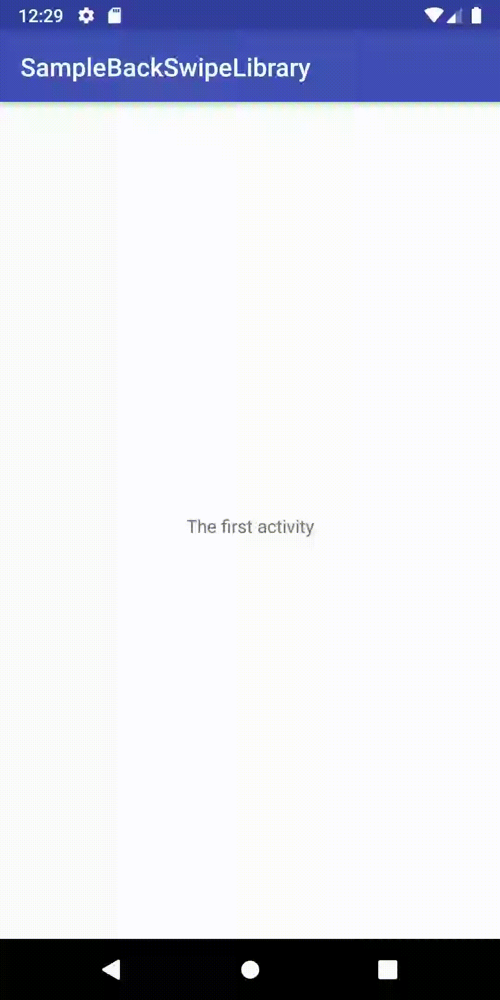

Backswipelibrary
=====
[  ](https://bintray.com/vsmirnov/airdaydreamers/io.github.airdaydreamers.backswipelibrary/0.9.2/link)
A back swipe library for Android

Download
--------
Download the latest AAR grab via Gradle:
```groovy
repositories {
  google()
  jcenter()
}

dependencies {
implementation 'io.github.airdaydreamers.backswipelibrary:backswipelibrary:0.9.2'
}
```
or Maven:
```xml
<dependency>
	<groupId>io.github.airdaydreamers.backswipelibrary</groupId>
	<artifactId>backswipelibrary</artifactId>
	<version>0.9.2</version>
	<type>pom</type>
</dependency>
```

Demo
--------

#### Demo for Activity with action bar



#### Demo for Activity without action bar but with toolbar


#### Demo for Fragments


<!---//--->


How do I use?
-------------------

#### Apply theme for application

```xml
    <application
        android:theme="@style/bsl_Theme.Back.Swipe.ActionBar">
```

or for Activity. 

- without ActionBar

```xml
        <activity
            android:theme="@style/bsl_Theme.Back.Swipe">
```

- with ActionBar

```xml
        <activity
            android:theme="@style/bsl_Theme.Back.Swipe.ActionBar" />
```

#### In code:
You need extend for Activity `BackSwipeActivity`, for Fragment -> `BackSwipeFragment`

After setup some parameters and that's all;


```java
setEdgeOrientation(BackSwipeHelper.EdgeOrientation.LEFT);
setEdgeSizeLevel(BackSwipeHelper.EdgeSizeLevel.MED);
setEnableSwipe(true);
setTouchSlopThreshold(700.2f);
```

For fragment:
```java
    @Override
    public View onCreateView(LayoutInflater inflater, ViewGroup container,
                             Bundle savedInstanceState) {

        View view = inflater.inflate(R.layout.fragment_first, container, false);

        setFragmentBackground(R.color.colorPrimary);
        setEdgeOrientation(BackSwipeHelper.EdgeOrientation.LEFT);

        return attachToBackSwipe(view, BackSwipeHelper.EdgeSizeLevel.MIN);
    }
```

    "How to use" describtion is still in progress

You can check out the sample app in `app/` to see it in action.

Getting Help
------------
To report a specific problem or feature request, [open a new issue on Github][2]. For questions, suggestions, or
anything else, go to [discussion group][3].

Author
------
Vladislav Smirnov - @vladislav-smirnov on GitHub

License
--------

    Copyright 2018 Vladislav Smirnov.

    Licensed under the Apache License, Version 2.0 (the "License");
    you may not use this file except in compliance with the License.
    You may obtain a copy of the License at

       http://www.apache.org/licenses/LICENSE-2.0

    Unless required by applicable law or agreed to in writing, software
    distributed under the License is distributed on an "AS IS" BASIS,
    WITHOUT WARRANTIES OR CONDITIONS OF ANY KIND, either express or implied.
    See the License for the specific language governing permissions and
    limitations under the License.
    
[1]: https://github.com/vladislav-smirnov/backswipelibrary
[snap]: https://oss.sonatype.org/content/repositories/snapshots/
[2]: https://github.com/vladislav-smirnov/backswipelibrary/issues/new/choose
[3]: https://github.com/vladislav-smirnov/backswipelibrary/discussions
