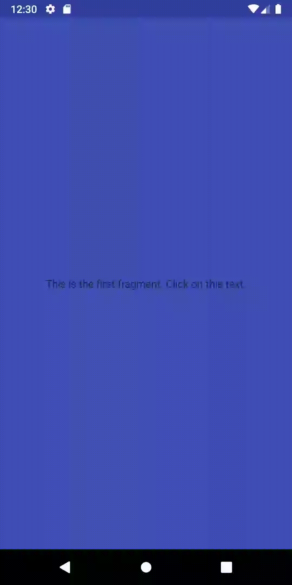

# Backswipelibrary
A back swipe library for Android

Download
--------
Download the latest AAR from [Maven Central][2] or grab via Gradle:
```groovy
implementation '***'
```
or Maven:
```xml
<dependency>
  <groupId>***</groupId>
  <artifactId>***</artifactId>
  <version>***</version>
</dependency>
```

Snapshots of the development version are available in [Sonatype's `snapshots` repository][snap].

Demo for Activity with action bar
--------


Demo for Activity without action bar but with toolbar
--------


Demo for Fragments
--------

<!---//--->


License
--------

    Copyright 2018 Vladislav Smirnov.

    Licensed under the Apache License, Version 2.0 (the "License");
    you may not use this file except in compliance with the License.
    You may obtain a copy of the License at

       http://www.apache.org/licenses/LICENSE-2.0

    Unless required by applicable law or agreed to in writing, software
    distributed under the License is distributed on an "AS IS" BASIS,
    WITHOUT WARRANTIES OR CONDITIONS OF ANY KIND, either express or implied.
    See the License for the specific language governing permissions and
    limitations under the License.
    
 [1]: https://github.com/vladislav-smirnov/backswipelibrary
 [2]: https://search.maven.org/search?q=g:com.airdaydreamers.backswipelibrary%20AND%20a:backswipelibrary
 [snap]: https://oss.sonatype.org/content/repositories/snapshots/
